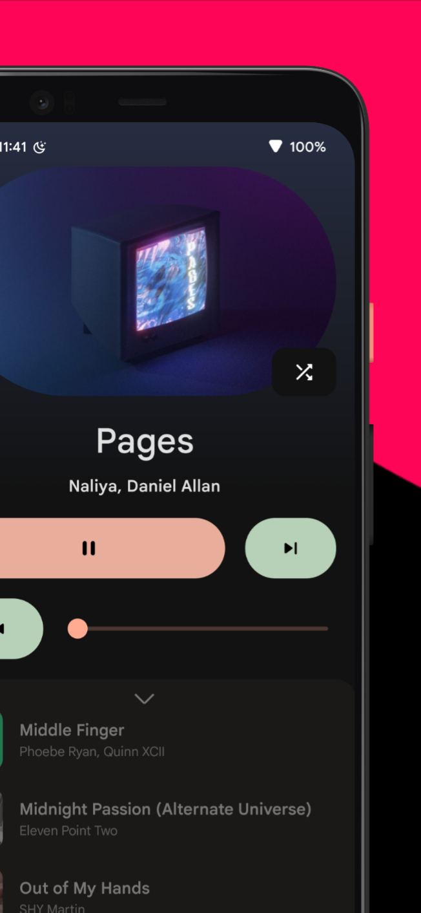
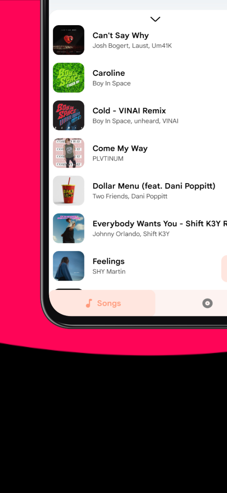
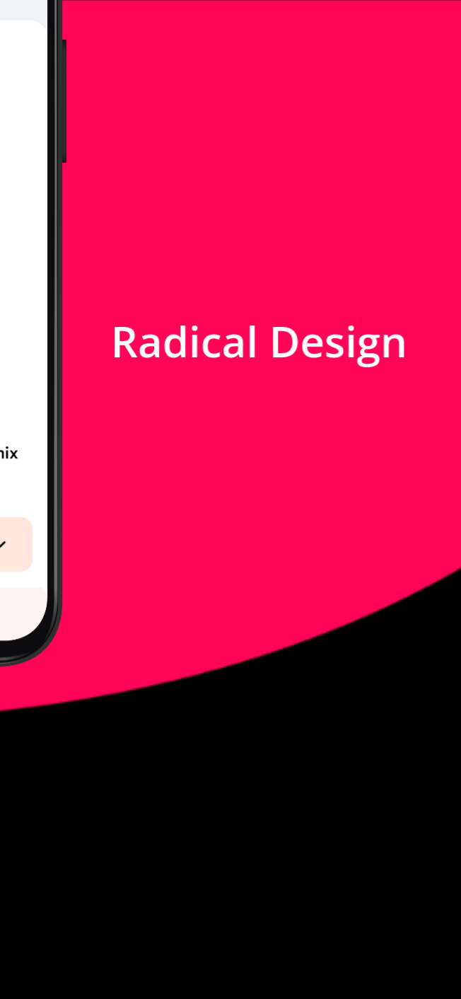
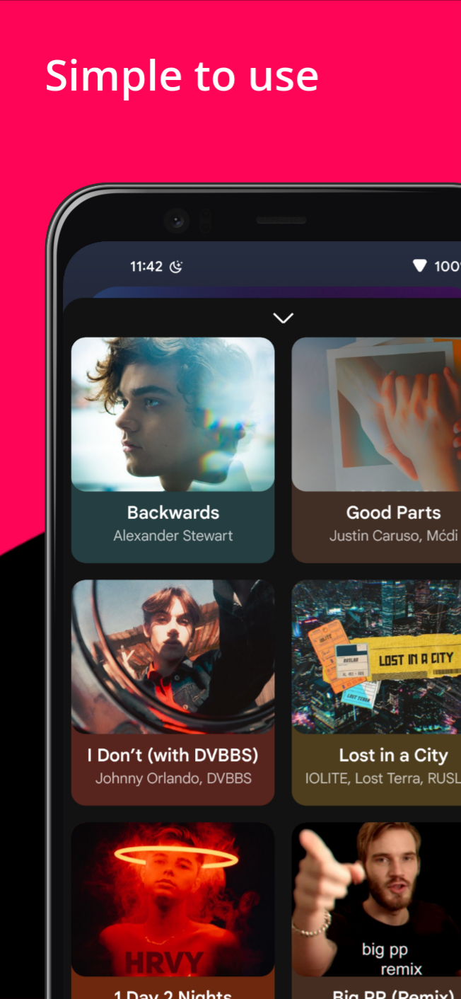

# Howl Music Player

### A *sleek* and *minimal* offline music player made with love

---

---

## :package: Features 

- Sleek and Responsive UI
  
- Material Design

- Minimal Layout With Amazing Transitions 

- More Coming Soon

## :iphone: Download

## :scroll: Licence
You may copy, distribute and modify the software as long as you track changes/dates in source files. Any modifications
to or software including (via compiler) GPL-licensed code must also be made available under the GPL along with build &
install instructions.

## :wave: Contribute
### Check out our [Telegram channel](https://telegram.me/IamlookerBuilds)
### Pull Requests are always welcomed!
